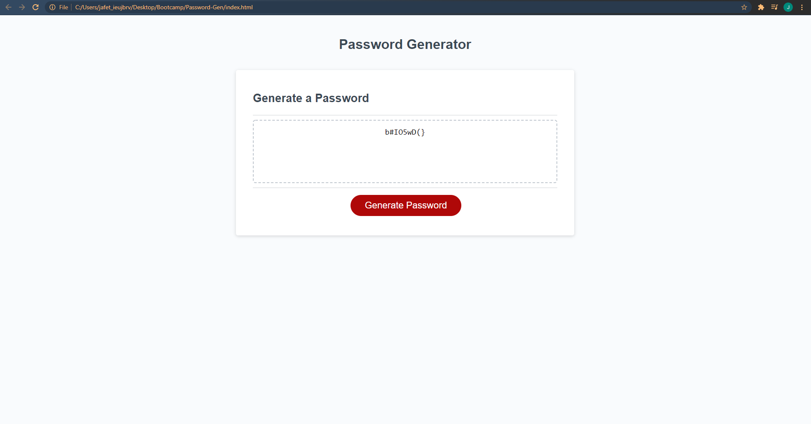

# 03 JavaScript: Password Generator

For this project, I had to create a random password generator. I was able to have the website prompt a series of questions for the user. These questions will determine what kind of characters the password will be composed of, such as capital letters, lowercase letters, numbers, and special characters. After user has answered all of the prompts the webspage will then generate a randomized password accordingly!

Website Link: https://jmanauth.github.io/Password-Gen/